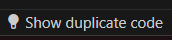

# PMD Copy Paste Detection VSCode Extension

A tool to highlight lines of duplicated code flagged by [PMD CPD](https://docs.pmd-code.org/latest/pmd_userdocs_cpd.html)

## Features

- Show [PMD-CPD](https://pmd.github.io/latest/pmd_userdocs_cpd.html) duplication information.
- Hover text has links to other files with the duplicate code.
- Highlights colours based on minor, major, and critical based on number of tokens.
- Show / Hide status bar item

  

## Requirements

- [PMD CLI 7.0.0](https://github.com/pmd/pmd/releases/latest) or higher installed and in path

## Commands / Actions

- `Show Duplicate Code`: Shows duplicate code highlighted in editor.
- `Hide Duplicate Code`: Hides duplicate code highlighting.
- `Refresh Duplicates`: Refresh duplicates from the report xml file.
- `Scan Source for Duplicate`s: Run PMD CPD command and update highlighting.

## Extension Settings

- `minimumDuplicateTokens`: The minimum number of token to consider a duplicate. See [PMD CPD CLI options --minimum-tokens](https://docs.pmd-code.org/latest/pmd_userdocs_cpd.html#cli-options-reference).
- `minorIssueTokenThreshold`: The token threshold to flag minor issues. Anything below this will be highlighted as minor.
- `majorIssueTokenThreshold`: The token threshold to flag major issues. Anything below this but above minor will be highlighted as major. Anything over this is critical.
- `onStartBehavior`: Specifies on load of extension to show or hide highlighting duplicate code.
- `language`: Specifies PMD CPD language. See https://pmd.github.io/pmd/pmd_userdocs_cpd.html#supported-languages
- `sourceDirectory`: Specifies the source folder to scan.

## Known Issues

- Likely a few
